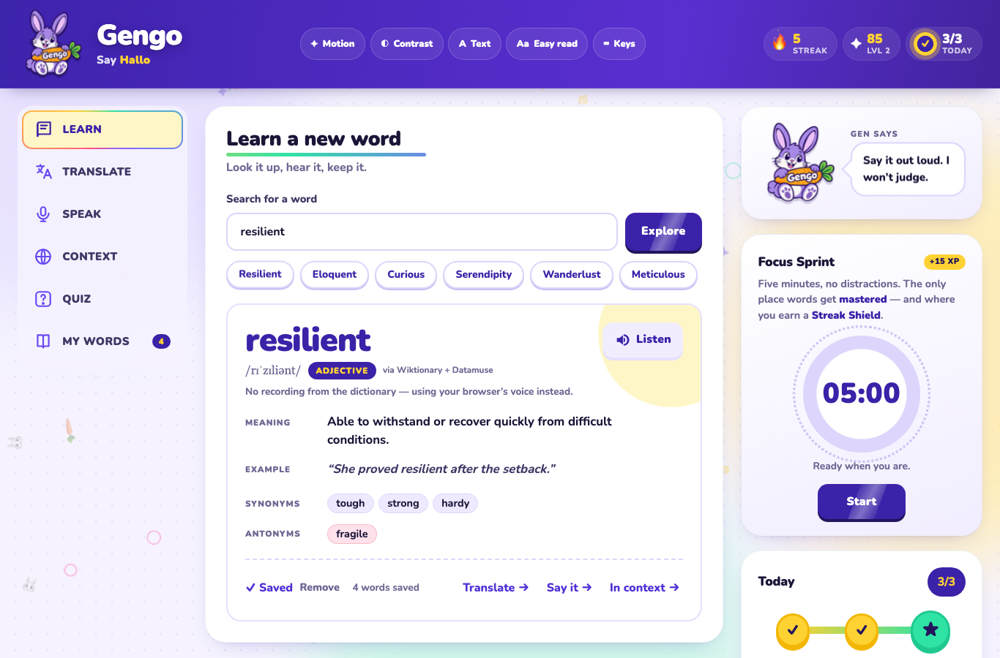
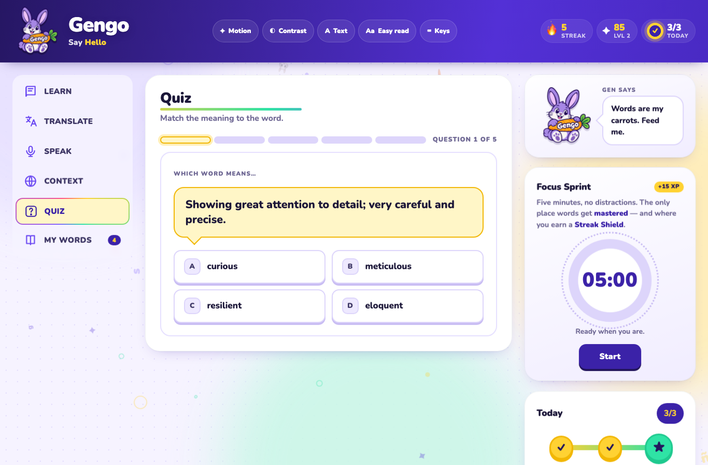
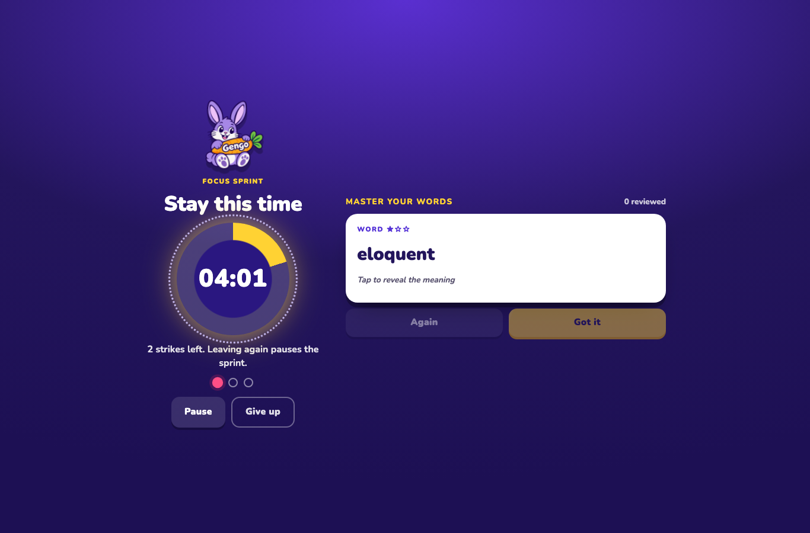
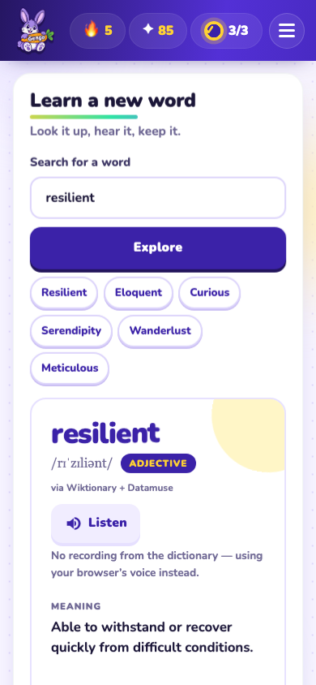
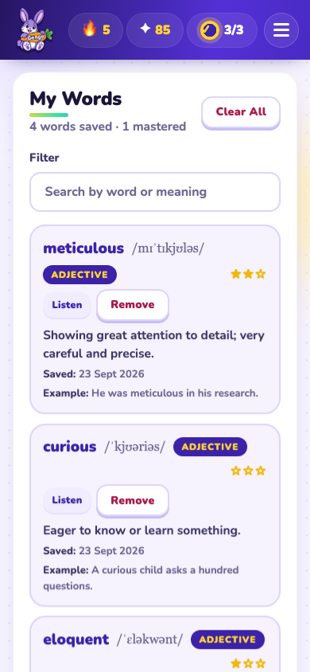
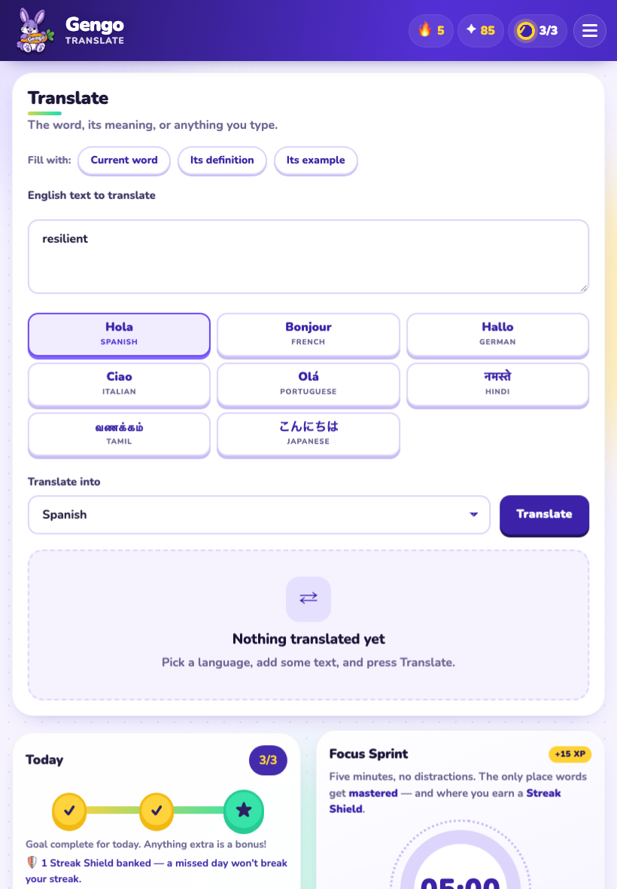

# Gengo — UI/UX Interface Guide

> How Gengo looks, moves and behaves, screen by screen. Companion to [README.md](README.md) (features, APIs, storage) — this file is about the **interface**.

Live app: https://praneet-admin.github.io/gengo/



---

## 1. Design principles

| Principle | What it means in Gengo |
|---|---|
| **One thing per screen** | Six sections, one visible at a time. Each panel has a single heading, a one-line purpose, one primary action. |
| **Playful, not childish** | Duolingo/Pinterest-inspired: rounded cards, pressable buttons, a mascot with moods — but readable type, real contrast ratios, no clutter. |
| **Every action gets feedback** | Toasts, sparkles, confetti, mascot speech, XP counters ticking up, screen-reader announcements. Nothing happens silently. |
| **Same app on every device** | Laptop, tablet and phone get the same features; only the frame changes (left rail → hamburger drawer). |
| **Accessible by default** | Keyboard first, screen-reader labels on everything, 44 px touch targets, reduced-motion / high-contrast / larger-text / easy-read switches on desktop. |

---

## 2. Visual identity

### 2.1 Mascot — Gen the rabbit
The purple rabbit holding a "Gengo" carrot is the logo, the favicon, the sidebar buddy and the focus-screen companion. Same artwork everywhere (`assets/bunny-*.png`), animated with CSS:

| Mood | Trigger | Motion |
|---|---|---|
| idle | always | slow float / breathe |
| happy | word saved, correct answer | hop |
| cheer | goal reached, sprint finished, round complete | bounce + sparkles |
| sad | wrong answer, left the sprint (strike) | wobble, desaturated |
| think | searching, sprint running | tilt |

Gen talks through a speech bubble ("Gen says") — short, warm, never blocking.

### 2.2 Colour — "Electric Playground"

```
Brand (indigo)   --brand-900 #23155c  --brand-800 #3b22a8  --brand-700 #5330d6
                 --brand-500 #8466ff  --brand-100 #e6e0ff  --brand-050 #f1edff
Accent (yellow)  --accent-600 #f2b705  --accent-500 #ffd233  --accent-100 #fff6c7
Mint (success)   --mint-500 #2fe3a5   --mint-100 #d9fbef
Danger (pink)    --danger-700 #a81848  --danger-600 #c9245a  --danger-500 #ff4f86
Background       --bg-050 #f6f3ff  --bg-100 #eee9ff  --bg-200 #ddd5fb  (lavender)
Ink (text)       --ink-900 #1b1638  --ink-700 #3f3866  --ink-500 #6f6894
Cards            #ffffff
```

Rules: indigo for structure and primary actions, yellow for reward/selection, mint for "correct", pink only for destructive/wrong. Body text is `--ink-900` on white or lavender (≥ 7:1). Text on indigo is pure white. Every colour has a forced-colours (Windows High Contrast) fallback.

### 2.3 Typography
- **Nunito** 700/800/900 (Google Fonts) — rounded, friendly, very legible; system-ui fallback.
- Brand name: 900 weight, solid white, soft dark drop-shadow (2.4 rem desktop / 1.6 rem tablet).
- Headwords: extra-large, letter-by-letter reveal animation, auto-shrinks to fit narrow screens.
- Base 16 px, line-height 1.5; three text-size steps available from the header.

### 2.4 Shape & depth
- Radii: 28 / 20 / 14 / 10 px and pill (999 px). Cards `--radius-xl`, buttons `--radius-md`, chips pill.
- **Pressable buttons**: a solid 4 px bottom "edge" that collapses on press (Duolingo-style), hover lifts 2 px.
- Cards: white, soft indigo-tinted shadow, no hard borders.
- Background: lavender with a faint dot grid, slow drifting colour blobs and small floating letters / rings / carrots (0.7–1.8 rem, ~30 % opacity). All of it is hidden under `prefers-reduced-motion`.

---

## 3. Layout & responsiveness

```
≥ 1101 px  (laptop)              ≤ 1100 px (tablet & phone)
┌──────────────────────────┐     ┌──────────────────────────┐
│ header (scrolls away)    │     │ header (sticky)  ☰       │
├────┬──────────────┬──────┤     ├──────────────────────────┤
│rail│   main panel │side- │     │        main panel        │
│    │              │ bar  │     ├──────────────────────────┤
│    │              │      │     │  Today · Sprint · Gen    │
└────┴──────────────┴──────┘     └──────────────────────────┘
                                  ☰ opens a right-hand drawer
```

- **Header**: rabbit logo (92 px), brand name + "Say *Bonjour*" greeting that cycles through languages, display tools (desktop only), and three stat pills — 🔥 streak, ✦ XP/level, ◔ today's goal. On laptop the header scrolls with the page so it can never cover content; on smaller screens it is a short sticky bar holding the ☰ button.
- **Rail** (laptop): sticky left rail. On wide screens (≥ 1366 px) each tab shows icon + label; on smaller laptops it collapses to a 76 px icon rail (labels for screen readers and on hover). Selected tab is a yellow card with a rainbow border.
- **Drawer** (tablet/phone): full-height white drawer from the right with a "Menu" head, six 54 px rows (icon + label + badge), dimmed backdrop, Esc / backdrop / ✕ to close, focus trapped inside.
- **Sidebar** (laptop) / stacked cards (phone): Gen's speech bubble, Focus Sprint, Today. On phones the order is Today → Sprint → Gen.
- Breakpoints: 1100, 900, 640, 430, 360 and 320 px are all checked for overflow; no horizontal scroll at any of them.

---

## 4. The six sections

### 4.1 Learn
*"Look it up, hear it, keep it."*
- Search field + **Explore** button, six suggestion chips (Resilient, Eloquent, …).
- **Skeleton card** while loading ("Looking up *serendipity*…").
- **Word card**: headword (animated letters), IPA, part-of-speech tag, source note ("via Wiktionary + Datamuse"), **Listen** button; Meaning / Example / Synonyms / Antonyms rows, each with its own small Listen.
- **Save Word (+10 XP)** primary button → turns into "✓ Saved · Remove"; saved-count next to it.
- Next-step links: *Translate → · Say it → · In context →* carry the word to the other sections.
- Empty state: Gen + "Your next word is waiting". Error state: plain-English message, **Try again**, "Take a quiz instead".

### 4.2 Translate
*"The word, its meaning, or anything you type."*
- "Fill with" chips: Current word / Its definition / Its example (auto-prefilled with the current word).
- Text area (600 chars), then a **language card grid** — each card shows the greeting in that language over its name (Hola / SPANISH, Bonjour / FRENCH, வணக்கம் / TAMIL …); the selected card is raised and indigo. A select box mirrors the choice for screen readers.
- Result: two columns — English → target (with Listen). No settings, no keys.

### 4.3 Speak
*"Hear it, then say it back."*
- **Listening** card: voice switch **Female (Karen) / Male (Daniel)** — the two clearest voices on Mac; the switch hides itself on devices with a single English voice. Play word / definition / example, **Stop**.
- **Speaking practice** card: choose *the word* or *the example sentence*, big mic button with a pulsing dot and a waveform while listening; result shows "We heard …", a match meter and feedback. If the browser's recogniser is blocked, Gengo switches to on-device Whisper (with a progress note) and always offers **type what you hear** as a fallback.

### 4.4 Context
*"How the word shows up in real writing."*
- Search box defaulting to the current word → up to three Wikipedia cards: thumbnail, title, excerpt with the word highlighted, "Read on Wikipedia ↗".
- Loading / none-found / error states with retry.

### 4.5 Quiz



*"Match the meaning to the word."*
- Unlocks at 4 saved words (empty state says so, with **Find words**).
- Rounds of 5: segmented progress bar + "Question 2 of 5"; definition in a yellow quote block; four **A–D option buttons** (keys 1–4 / A–D also work).
- Correct → mint highlight, +5 XP pill, combo counter "×3"; wrong → pink shake, correct answer revealed. **Continue** / **Finish round**.
- **Round complete!** dialog: Gen cheering, three tiles (Total XP ⚡ · Accuracy 🎯 · Time ⏱), Continue.

### 4.6 My Words
- Header count "4 words saved · 1 mastered", **Clear All** (confirmation dialog: *Keep my words / Clear everything*).
- Filter field; word cards with headword, IPA, POS tag, **mastery stars ★★☆**, definition, saved date, example, Listen / Remove.
- Removing slides the card out; the quiz and nav badge update live.

---

## 5. Sidebar cards

**Gen says** — mascot + speech bubble; reacts to whatever you just did.

**Focus Sprint** — ring timer (05:00), status line, **Start / Pause / Reset**, "+15 XP" pill. Copy states the purpose: *the only place words get mastered, and where you earn a Streak Shield.*

**Today** — goal path (1 → 2 → ★) that fills as you complete 3 activities, streak-shield line (🛡 banked / none), seven-day strip (dots with counts, 🛡 on shielded days, dashed ring on today), big flame with the streak number, best streak, level bar with "65 XP · 55 XP to Level 3".

---

## 6. Focus screen (sprint running)



Pressing **Start** takes over the whole viewport (and asks the browser for fullscreen):

- Indigo full-bleed background, Gen at the top, "Stay with me", a large ring timer, a status line and **three strike dots**.
- **Flashcard drill** ("Master your words"): white card showing the word and its ★ mastery; tap / Space flips to the meaning + example; **Again** / **Got it** (← / → keys). Got it = +1 star (one step per word per sprint) and +2 XP; a card marked Again returns later in the deck.
- Leaving the tab/app pauses the timer and lights a strike (toast + Gen turns sad); three strikes cancel the sprint. A 3-second grace after Start absorbs the fullscreen transition; Esc out of fullscreen is not a strike.
- **Pause · Resume sprint · Give up** at the bottom. Completion: confetti, "Focus sprint complete! +15 XP · 6 cards reviewed · 🛡 Streak Shield earned".
- Laptop: timer column left, card column right. Phone: stacked, buttons full-width.

---

## 7. Components

| Component | Look | Behaviour |
|---|---|---|
| Primary button (`.btn-primary`) | indigo, white text, 4 px darker edge | lifts on hover, presses down on click, `focus-visible` ring yellow |
| Lime/accent button | yellow, indigo text | used for "Continue", "Got it", "Resume" |
| Secondary / ghost | white or transparent with indigo border | never the only way to do something important |
| Danger text button | pink text ("Remove", "Clear All") | always followed by confirmation for bulk actions |
| Chip | pill, white, indigo text | suggestions, fill-with, synonyms (click to look up) |
| Card | white, 28 px radius, soft shadow, fade-up on entry | staggered entry for lists |
| Dialog | centred card, dimmed backdrop, `<dialog>` element | Esc closes, focus returns to the opener |
| Toast | bottom-left (bottom-centre on phone), icon + text, 4 kinds: info / success / celebrate / warn / error | auto-dismiss 3–5 s, never stacks more than 3 |
| Progress ring / segments | conic-gradient ring, 5 segments for quiz | `role="progressbar"` with live values |
| Live announcer | invisible `aria-live` region | mirrors every toast and state change for screen readers |

---

## 8. Motion & feedback

- Entry: header gradient slowly flows; cards fade-up with 60 ms stagger; sidebar cards 300/400/500 ms.
- Rewards: XP numbers tween up; `sparkle()` bursts on the element that earned it; `confetti()` on goals, round completions, sprints.
- Micro: headword letters drop in one by one; timer digits "tick"; nav badge pops when the count changes; quiz options shake (wrong) or glow (right).
- Ambient: floating letters/rings/carrots and colour blobs behind everything, small and subtle.
- **Everything animated respects** `prefers-reduced-motion` and the in-app Motion switch (`body.reduce-motion`): animations off, transitions instant, floaters hidden.

---

## 9. Accessibility & inclusive UX

- **Keyboard**: Tab order follows the visual order; Alt+1–6 jump to sections, ← → move between tabs, `/` focuses search, 1–4 / A–D answer quiz, `L` listens, `?` shows the shortcut sheet, Esc closes anything. Skip-link to main.
- **Screen readers**: every icon button has an `aria-label`; tabs/tabpanels, progressbars, meters, timers and dialogs use the proper roles; a polite live region announces results, XP, strikes, goal progress.
- **Low vision**: ≥ 7:1 body contrast, High-contrast switch (thicker borders, darker inks), three text sizes, Easy-read (wider spacing, plain font), Windows forced-colours support.
- **Deaf / hard of hearing**: nothing is audio-only — every Listen has text, speaking practice has a typed fallback.
- **Dyslexia**: Nunito, generous line-height, Easy-read mode, short sentences, no justified text.
- **Motor**: 44 px minimum targets, no hover-only controls, no time limits outside the optional sprint.
- **Platform**: shortcut labels say ⌥ on Mac / Alt on Windows; voice tips point to the right OS settings.
- Audited with axe-core at 320–1456 px: 0 violations.

---

## 10. Key user flows

**First visit** → Learn is open with Gen greeting you → tap a suggestion chip → word card appears → **Save Word (+10 XP)** → toast + sparkle, Today shows 1/3.

**Daily loop (≈ 5 min)** → Learn 1 word (save) → Quiz a round → Focus Sprint with flashcards → goal 3/3 → confetti + **Daily recap** dialog (XP, saves, quiz, sprints, streak flame).

**Mastering a word** → save it → it appears in the sprint drill → "Got it" in three different sprints → ★★★ in My Words, "1 mastered" in the header.

**Missing a day** → next visit, a banked 🛡 Streak Shield is spent automatically → toast "yesterday is covered, your 3-day streak lives on", 🛡 in the week strip.

---

## 11. Tone of voice

Short, second person, encouraging, a little cheeky, never scolding.
- ✅ "Words are my carrots. Feed me." · "Five focused minutes. Respect." · "Hey! Come back. That's a strike."
- ❌ "Error 429" · "Invalid input" · "You failed".

Errors always say what happened *and* what to do next ("MyMemory's free quota for today is used up. Try again tomorrow.").

---

## 12. Screens at a glance

| Screen | Primary action | Reward |
|---|---|---|
| Learn | Explore → Save Word | +10 XP, activity |
| Translate | Translate | — (utility) |
| Speak | Play / Start speaking | practice feedback |
| Context | Find articles | — (utility) |
| Quiz | Answer → Continue | +5 XP each, round tiles |
| My Words | Filter / Listen / Remove | mastery stars |
| Focus Sprint | Start → drill → finish | +15 XP, +2 XP/card, 🛡 shield, ★ mastery |

| Phone — Learn | Phone — My Words | Tablet — Translate |
|---|---|---|
|  |  |  |
