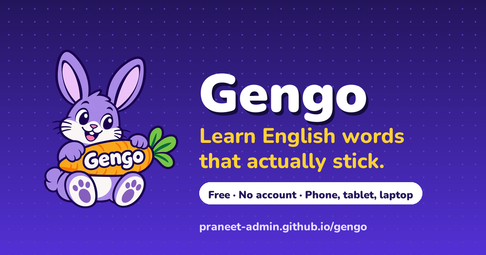
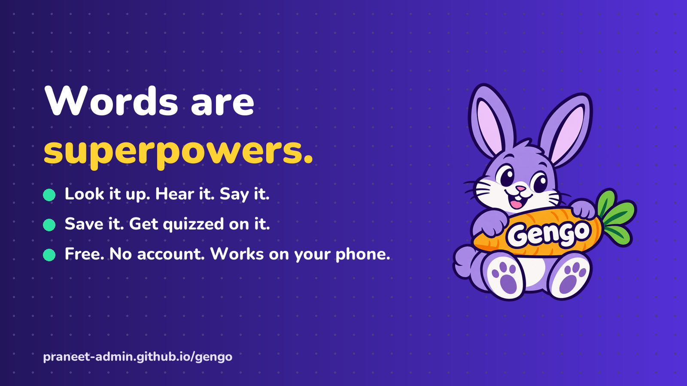
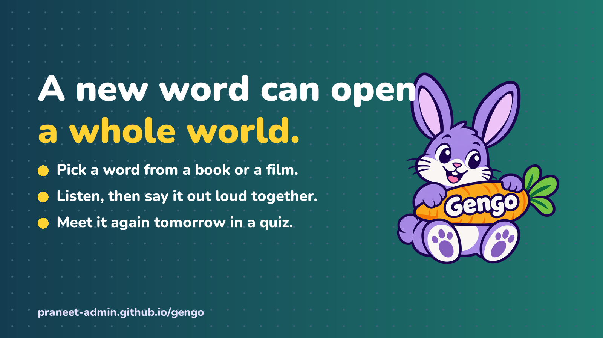
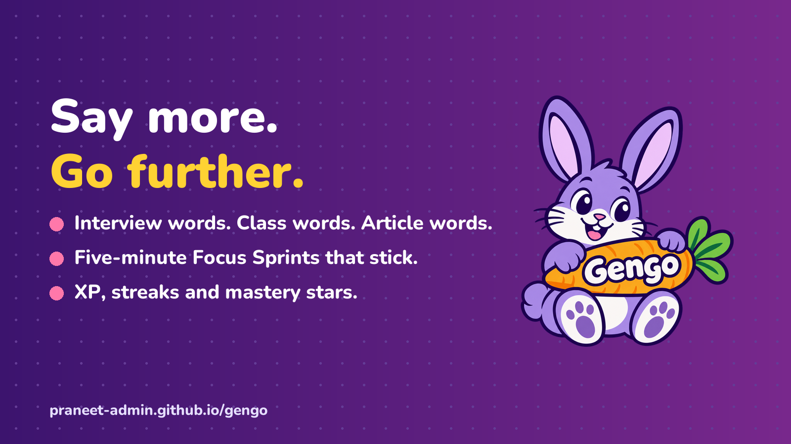

# Words Are Superpowers: Meet Gengo

## A playful, free way for curious kids and ambitious young adults to discover, say and remember better English words.

Every new word gives us another way to understand an idea, tell a story, ask a better question or share exactly what we mean.

That is the idea behind **Gengo**, a playful English vocabulary trainer built around one simple belief:

> **Words are superpowers.**

Gengo brings definitions, pronunciation, speaking practice, translation, real-world context, saved words and quizzes into one cheerful learning space. It is free, works in the browser and welcomes learners straight in.

Meet Gengo here: **https://praneet-admin.github.io/gengo/**

---

## Say hello to Gen 🐰

Gen is Gengo’s purple rabbit guide: part coach, part study buddy and always ready for the next word.

Gen celebrates saved words, quiz wins, daily goals and focused learning sessions. The character gives every activity a little warmth and turns vocabulary practice into something learners can look forward to.

The visual world follows the same spirit: deep violet, sunny yellow, mint, playful motion and clear, welcoming cards. Learners can also choose larger text, higher contrast, reduced motion and an easy-read mode.

---

## For curious kids

For children aged 8–12, Gengo works beautifully as a shared activity with a parent, teacher or older family member.

A child can choose a word from a book, lesson, film or everyday conversation and explore it together with an adult:

1. **Look it up** and read a clear meaning.
2. **Listen** to how it sounds.
3. **Say it aloud** and practise with the speaking activity.
4. **See it in context** through examples and real-world references.
5. **Save it** and meet it again in a quiz.

One word can lead to a story, a drawing, a conversation or a brand-new interest. Gengo gives families and classrooms a colourful place to begin that journey.

---

## For ambitious young adults

Words also create momentum for young adults—in study, university, work, interviews, presentations and everyday conversation.

Gengo lets each learner build a vocabulary collection around the life they already have. A word from an article can become a saved card. A word from class can become speaking practice. A word for an interview can become part of a five-minute Focus Sprint.

The learner chooses the words. Gengo supplies the practice loop:

**Discover → Hear → Say → Understand → Save → Recall**

Short daily sessions add XP, goals, streaks and mastery progress, creating a learning rhythm that feels light while steadily building confidence.

---

## One word, many ways to learn

Type any English word into Gengo and the experience opens outward:

- A clear definition and phonetic spelling
- Natural pronunciation audio
- Example sentences, synonyms and antonyms
- Translation into languages including Hindi, Tamil, Spanish, French, German, Italian, Portuguese and Japanese
- Wikipedia context that shows the word in real writing
- Speaking practice with visible feedback
- A personal saved-word collection
- Five-question quiz rounds built from saved words
- A five-minute Focus Sprint with flashcards, mastery stars and XP

All of these paths meet in one place, so learners can engage with a word through sight, sound, speech, meaning and recall.

---

## Designed for more learners

Gengo’s accessibility features are part of the experience from the start.

Keyboard navigation, screen-reader announcements, visible focus states and generous touch targets support different ways of interacting. Every audio activity has visible text. Display controls support larger text, stronger contrast, reduced motion and easier reading. The interface also adapts smoothly from phones to tablets and laptops.

The goal is simple: more learners should feel comfortable exploring words in the way that suits them.

---

## Free, private and ready to open

Gengo is free to use. It asks for no account and stores learning progress in the learner’s own browser.

The app is built with HTML, CSS and JavaScript and hosted on GitHub Pages. Its dictionary, translation and context features use open web services, keeping the experience lightweight and accessible.

That means the first step is wonderfully small: open Gengo and choose one word.

---

## Try the seven-day Word Adventure

Here is a joyful way to begin:

**Day 1:** Pick a word that sounds interesting.  
**Day 2:** Listen and say it aloud.  
**Day 3:** Use it in a sentence.  
**Day 4:** Find it in an article, book or video.  
**Day 5:** Add two related words.  
**Day 6:** Complete a quiz or Focus Sprint.  
**Day 7:** Share your favourite word with someone.

Parents and teachers can join children in the adventure. Young adults can make it a personal seven-day challenge. Everyone finishes with a small collection of words that feel familiar, useful and genuinely theirs.

---

## Start with one word today

Open Gengo: **https://praneet-admin.github.io/gengo/**

Explore the source and guides: **https://github.com/praneet-admin/gengo**

And if one word makes you smile, think or express yourself more clearly, share it. Someone else may discover their next favourite word through you.

**One purple rabbit. One useful word. A whole world to explore.**

---

*Topics: English Learning · Vocabulary · Education · EdTech · Learning Through Play*
